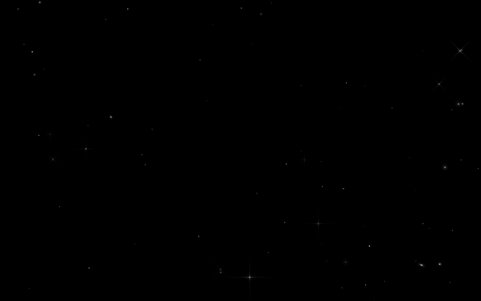

# 🌌 Animated Wallpapers

> Wallpapers animados feitos com HTML e JavaScript puro, leves, personalizáveis e compatíveis com Wallpaper Engine.

---

## ✨ Wallpapers disponíveis

### 🌠 Starfield
Um céu noturno animado com classificação estelar realista, galáxias, estrelas cadentes, satélites e muito mais, tudo renderizado em Canvas a 30fps. O fundo é preto puro (`#000000`), ideal para telas OLED.

**Preview:**



**Efeitos:**
- Estrelas com brilho pulsante e **classificação espectral realista** (classes M, K, G, F, A, B e O), cada tipo com cor, tamanho e frequência de ocorrência próprios
- **Spikes de difração** em estrelas mais brilhantes (tipos A, B e O), em cruz ou diagonal
- **Aglomerados estelares** (star clusters) com distribuição gaussiana
- **Galáxias** em 4 paletas de cor (azuladas, quentes/neutras, avermelhadas com redshift e exóticas/roxas) com núcleo pulsante e ângulo de visão variável, de frente a quase de lado
- **Estrelas cadentes** cruzando a tela com rastro de luz que desvanece
- **Satélites** se movendo lentamente com leve cintilação de painel solar
- **Trens Starlink** em fileira com deploy progressivo simulado, satélites mais juntos no início e separando ao longo do tempo
- **OVNIs** raríssimos, com movimento errático, mudança brusca de direção e ciclo de cores piscando (verde, azul, roxo, vermelho, âmbar e branco)
- **Vinheta** escurecendo as bordas para dar profundidade

**Frequência dos eventos:**
| Evento | Intervalo aproximado |
|---|---|
| Estrela cadente | ~35s |
| Satélite | ~50s |
| Trem Starlink | ~4 minutos |
| OVNI | ~5 minutos |

---

## 🚀 Como usar

### No Wallpaper Engine
1. Abra o **Wallpaper Engine**
2. Clique em **"Criar wallpaper"** e selecione **"Web"**
3. Selecione o arquivo `starfield-wallpaper-static.html`
4. Aplique e aproveite

### No navegador
Basta abrir o arquivo `.html` diretamente no navegador, sem servidor, sem dependências externas.

### Como página web / fundo de site
Os wallpapers podem ser embutidos como `<iframe>` em qualquer projeto web:

```html
<iframe src="starfield-wallpaper-static.html" style="position:fixed;top:0;left:0;width:100%;height:100%;border:none;z-index:-1;"></iframe>
```

### Com [Lively Wallpaper](https://github.com/rocksdanister/lively) *(alternativa open source ao Wallpaper Engine)*
1. Abra o Lively
2. Arraste o arquivo `.html` para a janela
3. Defina como wallpaper ativo

---

## 🛠️ Tecnologias

- **HTML5 Canvas** para renderização dos efeitos
- **JavaScript puro**, sem frameworks, sem dependências
- **CSS3** para estilos base

---

## 📁 Estrutura do repositório

```
animated-html-wallpapers/
├── LICENSE
├── starfield-wallpaper-static.html
├── preview.gif
└── README.md
```

> Novos wallpapers serão adicionados seguindo esse padrão.

---

## 🤝 Contribuindo

Tem uma ideia de wallpaper? Abre uma issue ou manda um pull request, quanto mais efeitos, melhor.

---
 
## 🙏 Créditos
 
O wallpaper Starfield foi desenvolvido em colaboração com o [Claude](https://claude.ai) (Anthropic), que auxiliou na arquitetura dos efeitos e na implementação do código.

---

## 📄 Licença
 
[MIT](LICENSE), use, modifique e distribua à vontade.
 
---
